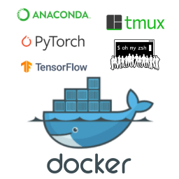

# Docker of anaconda with pytorch and tensorflow



## 1. What is this repository for ?

Usually configuring the environment is a boring and painful, and it's easy to make mistakes and takes a lot of time. Docker can help solve this problem very well.  

What is Docker? Docker is a tool designed to make it easier to create, deploy, and run applications by using containers. In a way, Docker is a bit like a virtual machine. But unlike a virtual machine, rather than creating a whole virtual operating system, Docker allows applications to use the same Linux kernel as the system that they're running on and only requires applications be shipped with things not already running on the host computer. 

This repository can help deep learning researchers configure a pytorch and tensorflow environment based on anaconda, together with oh-my-zsh and tmux, on any linux or mac machine within only a few minutes. You just need to know a few docker commands to get started.


## 2. How to use ?

Suppose you have cuda already installed, and cuda version is `cuda-9.0`, now you can go ahead with the following steps.

```bash
# download this repo
$ git clone https://github.com/ZQPei/docker_pytorch_tensorflow.git
$ cd docker_pytorch_tensorflow
```

### 2.1 install docker and nvidia-docker

```bash
# install docker
$ curl -fsSL get.docker.com -o get-docker.sh
$ sudo sh get-docker.sh --mirror Aliyun
# add user to docker group if you do not want sudo every time
$ sudo usermod -aG docker runoob 
$ systemctl enable docker
$ service docker start
# check if docker is installed successfully
$ docker run hello-world 

# install nvidia-docker and nvidia-docker-plugin
$ wget -P /tmp https://github.com/NVIDIA/nvidia-docker/releases/download/v1.0.1/nvidia-docker_1.0.1-1_amd64.deb
$ sudo dpkg -i /tmp/nvidia-docker*.deb && rm /tmp/nvidia-docker*.deb
# check if nvidia-docker is installed successfully
$ nvidia-docker run --rm nvidia/cuda nvidia-smi
```


### 2.2 build docker image

```bash
# for instance cuda-9.0
$ cp cuda-9.0/Dockerfile .
$ docker build -t pytorch_tf:gpu -f Dockerfile .

# it will take a while, please wait...

$ docker image ls
REPOSITORY              TAG         IMAGE ID            CREATED             SIZE
pytorch_tf              gpu         70fbd709e31e        3 minutes ago       9.76GB
hello-world             latest      fce289e99eb9        20 minutes ago      1.84kB

```


### 2.3 start a container

```bash
# start a container
$ docker container run -it \
    --name gpu_env \
    --runtime=nvidia -u pzq \
    --shm-size=16g pytorch_tf:gpu /bin/zsh
```


### 2.4 mount data and code to a container

```bash
# data and code should be independent with docker container by mounted to it.
$ docker container run -it \
    --name gpu_env \
    --runtime=nvidia -u pzq \
    --mount type=bind,source=/path/to/data,target=/home/pzq/Desktop/data \
    --mount type=bind,source=/path/to/code,target=/home/pzq/Desktop/code \
    --shm-size=16g pytorch_tf:gpu /bin/zsh

```